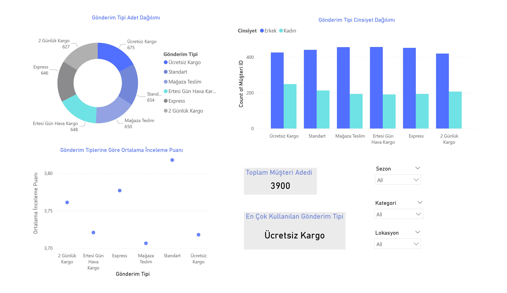

# Sales-Dashboard-with-Power-BI

Yıldız Teknik Üniversitesi Veri Bilimi Topluluğu tarafından düzenlenen **"Veri Analizi ve Görselleştirmenin Anahtarı: Power BI"** eğitimi kapsamında Kaggle E-Ticaret veri seti ile hazırlanmış bir satış dashboard projesidir.

## 1. Veri Modeli

## 2. Home

## 3. Gönderim Tipi Analizi

## 4. Kategori-Ürün Analizi

## 5. Sezon Analizi

## 6. En Çok Tercih Edilen 5 Renk

